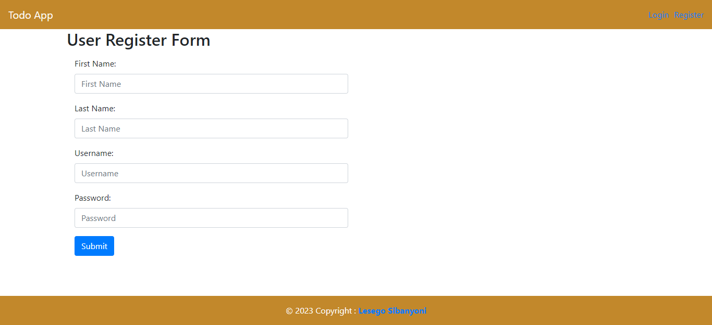
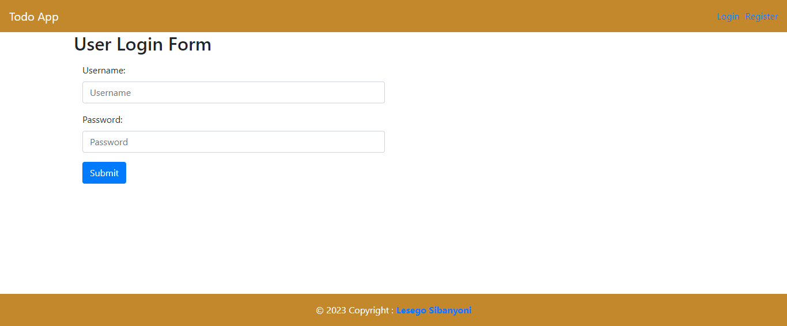
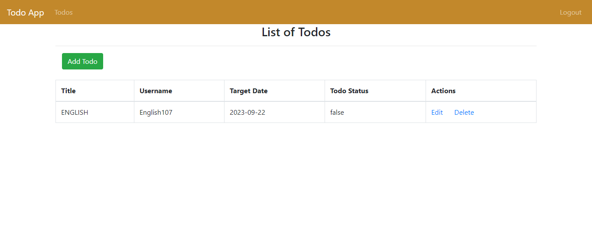
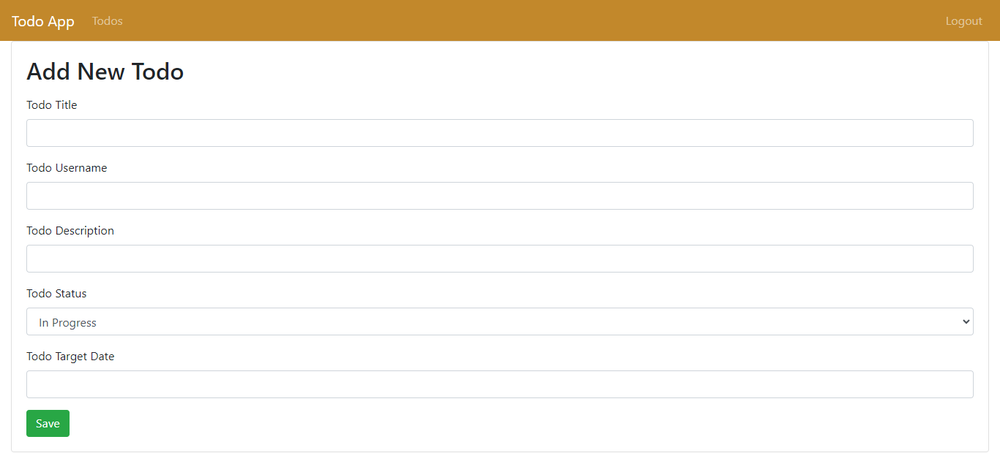

# Todo Application

This is a simple todo application built using Java, JDBC, MySQL, JSP, and Servlets. The application allows users to create, update, and delete tasks, as well as mark them as completed.

## Table of contents

- [Features](#features)
- [Technologies Used](#technologies-used)
- [Usage](#usage)
- [Screenshot](#screenshot)

## Features

- Users can register themselves
- Users can login
- Users can create a their first todo
- Users can edit their todo
- Users can delete their todo
- Users can update their todo

## Technologies Used

- Java 
- JDBC
- Servlet
- JSP
- MySQL

## Usage

1. Open the application in your web browser
2. Fill in the form to register yourself then click the 'submit' button
3. Navigate to the login page using the login link on the navigation bar then enter your username and password and click the 'submit' button
4. Create your first todo by clicking on the 'add todo' button fill in your details then click the 'save' button
5. Edit your todo by clicking on the 'edit' link in the 'Action' column, edit your details in the form then click the 'save' button to update your todo
6. Delete your todo by clicking on the 'delete' link in the 'Acion' column
7. Logout by clicking the 'logout' link on the navigation bar

## Screenshot

